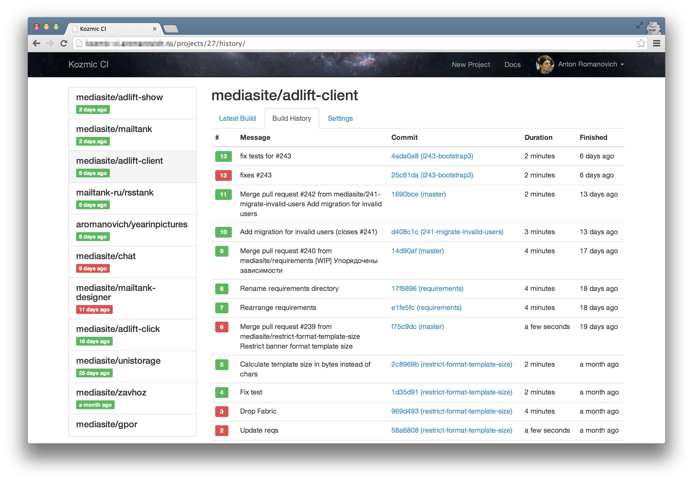
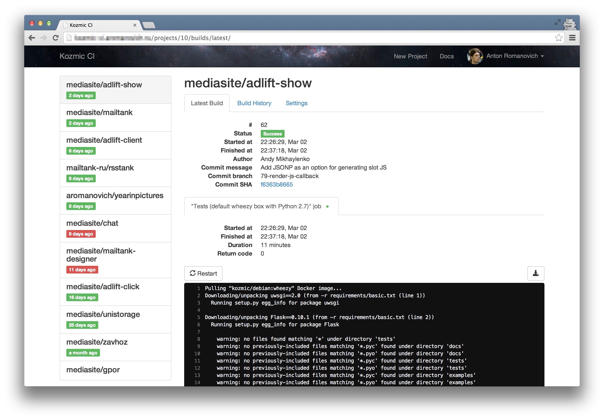
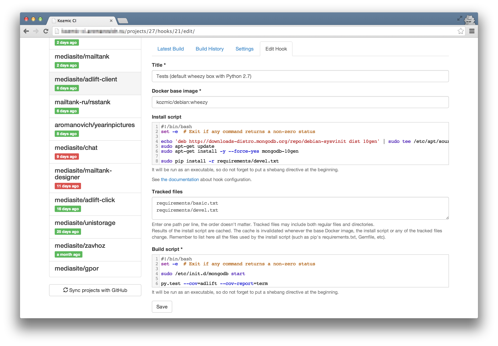

Kozmic CI
=========

Kozmic CI is a self-hosted continuous integration service. It is written in Python,
integrated with GitHub and powered by Docker.

.. toctree::
   :maxdepth: 2

   overview
   installation
   reference
   configuration
   internals
   contributing
   changelog
   contact
