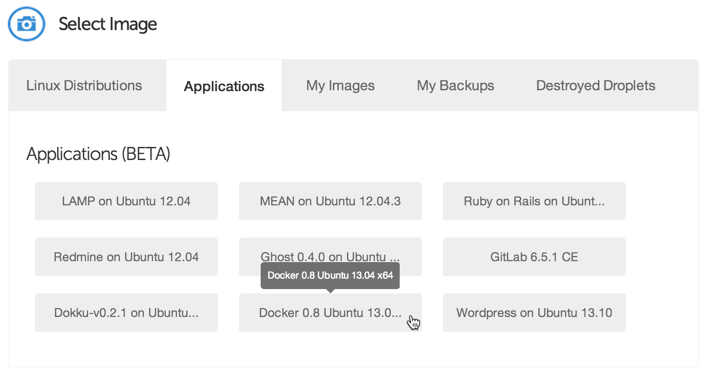

Installation and Set Up
=======================

.. toctree::
    :maxdepth: 2

The Fast Way
------------
Kozmic CI offers a Docker-based single-node distribution.

It has some limitations, but it's the fastest and easiest way to get started.

Step 1: Install Docker
~~~~~~~~~~~~~~~~~~~~~~
If you use `Digital Ocean`_, you can just create a droplet from an image
with pre-installed Docker:

If you use Ubuntu 13.04 or later, installing Docker is just as simple
as that::
    
    apt-key adv --keyserver keyserver.ubuntu.com --recv-keys 36A1D7869245C8950F966E92D8576A8BA88D21E9
    echo deb http://get.docker.io/ubuntu docker main > /etc/apt/sources.list.d/docker.list
    apt-get update
    apt-get install -f lxc-docker

If you use another OS, take a look at `Docker installation instructions`_.

Step 2: Register a new application on GitHub 
~~~~~~~~~~~~~~~~~~~~~~~~~~~~~~~~~~~~~~~~~~~~
Go to https://github.com/settings/applications/new and create a new application.

Set the homepage URL to ``http://my-server-ip-or-addr`` and the authorization
callback URL to ``http://my-server-ip-or-addr/_auth/auth-callback``.

Step 3: Start Kozmic CI
~~~~~~~~~~~~~~~~~~~~~~~
Create a directory for Kozmic CI logs::

    mkdir -p $HOME/kozmic-ci/log

Create a data-only container that will be used to persist the Kozmic CI data::
    
    docker run -v /var/lib/docker -v /var/lib/mysql -name kozmic-data ubuntu:12.04 true

Run Kozmic CI::

    JOB=$(docker run -e=SECRET_KEY=xxxxx \
                     -e=GITHUB_CLIENT_ID=xxxxxxxxxxxxxxxxxxxx \
                     -e=GITHUB_CLIENT_SECRET=xxxxxxxxxxxxxxxxxxxxxxxxxxxxxxxxxxxxxxxx \
                     -e=SERVER_NAME=xxx.xxx.xxx.xxx \
                     -p=80:80 \
                     -p=8080:8080 \
                     -volumes-from kozmic-data \
                     -v=$HOME/kozmic-ci/log:/var/log \
                     -privileged -d aromanovich/kozmic)
    docker logs $JOB

A few comments:

* ``SECRET_KEY`` must be set to a unique, unpredictable value. It *must* be
  kept the same if you are restarting or updating Kozmic CI container.
* ``GITHUB_CLIENT_ID`` and ``GITHUB_CLIENT_SECRET`` must contain the
  OAuth client id and secret of your GitHub application.
* ``SERVER_NAME`` must contain an IP address or domain name of the machine.
  It must be accessible from the outside Internet.
* ``-p=80:80 -p=8080:8080`` binds the container ports to the host system.
* ``-v=$HOME/kozmic-ci/log:/var/log`` mounts the directory from the host into
  the container which make is possible to see what's going on inside.
* ``-privileged`` key is required for running `Docker within Docker`_.

After starting the container, take a look at the ``logs`` directory content and
make sure that it doesn't say any errors. That's it!

The Usual Way
-------------
The usual way is to not use Docker-based distribution, but manually deploy each
of the three components:

* A web application that implements UI and exposes webhooks (:mod:`kozmic`)
* A uWSGI-application that sends a job log into a websocket (:mod:`tailer`)
* A Celery-worker that runs jobs

These components require Python 2.7, MySQL, Redis and Docker.

A `Kozmic CI's Dockerfile`_ is pretty much self-documenting about how to deploy
them.

It uses `Supervisor`_ for running all the components (see the last three
sections of `supervisor.conf`_) and `uWSGI`_ as an application server for
:mod:`kozmic` and :mod:`tailer` (see `kozmic-uwsgi.ini`_ and
`tailer-uwsgi.ini`_).

You will also have to use ``manage.py`` to run the database migrations::

    KOZMIC_CONFIG=kozmic.config_local.Config ./manage.py db upgrade

If you're planning to use Kozmic CI status images in GitHub README files,
they must be served through HTTPS to prevent GitHub from caching them
(see :setting:`KOZMIC_USE_HTTPS_FOR_BADGES` setting).

:mod:`tailer` **must** be run using uWSGI that is listed in its requirements
(``./requirements/tailer.txt``).

.. _Docker installation instructions: https://www.docker.io/gettingstarted/#h_installation
.. _Digital Ocean: https://www.digitalocean.com/?refcode=429df247edf9
.. _Docker within Docker: http://blog.docker.io/2013/09/docker-can-now-run-within-docker/
.. _Supervisor: http://supervisord.org/
.. _uWSGI: http://uwsgi-docs.readthedocs.org/en/latest/
.. _Kozmic CI's Dockerfile: https://github.com/aromanovich/kozmic-ci/tree/master/docker/Dockerfile
.. _supervisor.conf: https://github.com/aromanovich/kozmic-ci/blob/master/docker/files/supervisor.conf
.. _kozmic-uwsgi.ini: https://github.com/aromanovich/kozmic-ci/blob/master/docker/files/kozmic-uwsgi.ini
.. _tailer-uwsgi.ini: https://github.com/aromanovich/kozmic-ci/blob/master/docker/files/tailer-uwsgi.ini
